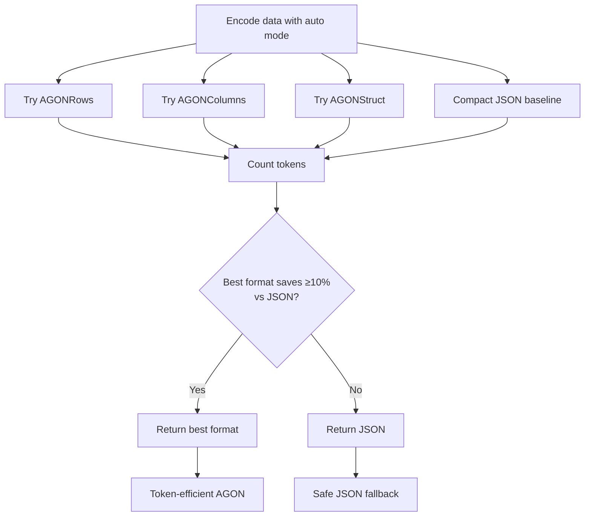

# AGON

**Adaptive Guarded Object Notation** — Self-describing, token-efficient JSON encodings optimized for LLM prompts with one guarantee: **never worse than compact JSON**.

## What is AGON?

AGON is an adaptive encoding library for Python that automatically selects the most token-efficient format for your data—**guaranteed to never be worse than compact JSON**. It provides multiple specialized encoding formats that can reduce token usage by 30-60% compared to JSON, while maintaining perfect lossless round-trip conversion.

### The Problem

Fixed-format encoders can actually make token counts **worse**. When your data doesn't match the encoder's assumptions (deeply nested objects, sparse arrays, irregular structures), you pay the overhead of the format without the benefits.

### AGON's Solution

Adaptive encoding with safety guarantees:

```python
result = AGON.encode(data, format="auto")
# Auto tries: rows, columns, struct
# Returns: whichever saves the most tokens
# Falls back: to compact JSON if none are better
```

!!! info "Rust-Powered Performance"

    AGON's core encoding engine is built in **Rust** with **PyO3 bindings**, delivering:

    - **Parallel format evaluation** using rayon for auto mode
    - **Native speed** with Python convenience

    See [Performance Benchmarks](benchmarks.md#performance) for detailed metrics.

---

## Quick Comparison: AGON vs TOON

| Aspect | TOON | AGON |
|--------|------|------|
| **Approach** | Single unified format | Multiple adaptive formats + JSON fallback |
| **Risk** | Can be worse than JSON on irregular data | **Never worse than JSON** (guaranteed) |
| **Format Selection** | Always applies TOON encoding | Auto-selects best format or falls back to JSON |
| **Best For** | Uniform arrays, consistent pipelines | Variable data shapes, risk-averse optimization |
| **Philosophy** | "One format for all JSON" | "Best format for each data shape, or JSON" |

For uniform arrays, `AGONRows` produces nearly identical output to TOON (tabs vs commas as delimiters, achieving the same token count). For everything else, AGON's adaptive approach ensures you always get the best result.

---

## Installation

Install AGON via pip:

```bash
pip install agon-python
```

Or using [uv](https://github.com/astral-sh/uv) (recommended):

```bash
uv add agon-python
```

---

## Quick Start

### Basic Usage

```python
from agon import AGON

# Sample data - list of objects with repeated structure
data = [
    {"id": 1, "name": "Alice", "role": "admin"},
    {"id": 2, "name": "Bob", "role": "user"},
    {"id": 3, "name": "Charlie", "role": "user"},
]

# Encode with auto-selection (tries rows/columns/struct, picks best or falls back to JSON)
result = AGON.encode(data, format="auto")
print(f"Selected format: {result.format}")  # → "rows"

# Use directly in LLM prompts - no header needed
prompt = f"""Analyze this user data:

{result}

What percentage are admins?"""

# Verify lossless round-trip
decoded = AGON.decode(result)
assert decoded == data  # ✅ Perfect reconstruction
```

### Format Outputs

AGON provides **three specialized formats**, each optimized for different data shapes. Auto mode tries all formats in parallel and selects the best:

=== "AGONRows"

    **Best for:** Uniform arrays of objects with consistent fields

    ```agon
    [3]{id	name	role}
    1	Alice	admin
    2	Bob	user
    3	Charlie	user
    ```

    **Ideal for:** User lists, transaction logs, simple metrics

    **Similar to:** [TOON format](https://toonformat.dev) (tabs instead of commas)

=== "AGONColumns"

    **Best for:** Wide tables (many columns) or numeric-heavy data

    ```agon
    users[3]
    ├ id: 1	2	3
    ├ name: Alice	Bob	Charlie
    └ role: admin	user	user
    ```

    **Ideal for:** Financial data (20+ fields), analytics tables

=== "AGONStruct"

    **Best for:** Repeated nested patterns like `{fmt, raw}` or `{value, timestamp}`

    ```agon
    @FR: fmt, raw

    price: FR("$100.00", 100.0)
    change: FR("+5.00", 5.0)
    volume: FR("1.2M", 1200000)
    ```

    **Ideal for:** Market data, API responses with nested structures

    **Similar to:** [TRON format](https://tron-format.github.io/) (abbreviated struct names)

=== "Token Comparison"

    Token counts for the user data example above:

    | Format | Tokens | Savings vs Pretty | Savings vs Compact |
    |--------|--------|-------------------|---------------------|
    | **Pretty JSON** | 62 | baseline | -68% |
    | **Compact JSON** | 37 | +40% | baseline |
    | **AGON Rows** | **26** | **+58%** | **+30%** ✅ |
    | **AGON Columns** | 28 | +55% | +24% |
    | **AGON Struct** | 35 | +44% | +5% |

    Auto mode selected **AGONRows** (best savings, exceeds 10% threshold vs compact JSON)

---

### Adaptive Auto Mode

The `format="auto"` mode tries all three formats in parallel and selects the winner:



**The guarantee:** Auto mode *never* returns a format with more tokens than compact JSON. If all specialized formats are worse or marginally better, it returns JSON.

---

## Use Cases

AGON excels in scenarios where data structure varies and intelligent format selection provides value:

### When AGON Helps Most

- **Variable data pipelines**: Data that changes shape (sometimes uniform arrays, sometimes nested objects) where auto-mode selects the optimal format
- **Uniform arrays**: Lists of consistent objects (AGONRows: up to 58% savings vs pretty JSON)
- **Wide tables**: Financial records, analytics data with 10+ columns (AGONColumns: up to 70% savings)
- **Repeated nested patterns**: Market data with `{fmt, raw}` structures (AGONStruct: up to 49% savings)
- **Cost-sensitive applications**: Where every token counts and honest fallback prevents wasted overhead
- **Data projection workflows**: Use cases where filtering fields before encoding is important (`AGON.project_data`)

### When AGON Helps Least

- **Tiny payloads**: <50 tokens where encoding overhead exceeds savings
- **Highly irregular objects**: No repetition or consistent structure (auto-mode falls back to JSON)
- **Single-use data**: Unpredictable, one-off structures with no patterns

!!! tip "When in doubt, use `format='auto'`"

    The safety guarantee means you can use auto mode everywhere. If specialized formats don't help, you'll get compact JSON—no harm done.

---

## Experimental: Asking LLMs to Generate AGON

**⚠️ Note:** LLMs have NOT been trained on AGON format, so accuracy cannot be guaranteed. This is an experimental feature. For production use, prefer **sending AGON to LLMs** (reliable) over **asking LLMs to generate AGON** (experimental, requires validation).

```python
from agon import AGON

data = [
    {"id": 1, "name": "Alice", "role": "admin"},
    {"id": 2, "name": "Bob", "role": "user"},
]

result = AGON.encode(data, format="auto")

# To ask an LLM to respond in AGON format, provide both:
# 1. Generation instructions via result.hint()
# 2. An example with header via result.with_header()
prompt = f"""Analyze this user data and return enriched data in AGON format.

Instructions: {result.hint()}

Example output:
{result.with_header()}

Task: Add an is_admin boolean field and return in the same format."""

# Decode LLM response using header to auto-detect format
# parsed = AGON.decode(llm_response)
```

See the [API Reference](api.md#hint) for details on `hint()` and `with_header()` methods.

---

## Next Steps

### [Core Concepts](concepts.md)

Understand AGON's adaptive approach, format selection, and design principles

### [API Reference](api.md)

Complete documentation of all methods, parameters, and classes

### [Format Documentation](formats/rows.md)

Detailed guides for each specialized format:

- [AGONRows Format](formats/rows.md) - Row-based tabular encoding
- [AGONColumns Format](formats/columns.md) - Columnar transpose encoding
- [AGONStruct Format](formats/struct.md) - Template-based encoding
- [JSON Fallback](formats/json.md) - When and why AGON returns JSON

### [Benchmarks](benchmarks.md)

Real-world token savings and performance metrics across 7 datasets

---

## Community & Contributing

AGON is open source and welcomes contributions!

- **Issues**: [Report bugs or request features](https://github.com/Verdenroz/agon-python/issues)
- **Contributing**: See [development guide](https://github.com/Verdenroz/agon-python#development)
- **Related projects**: [TOON](https://toonformat.dev) | [TRON](https://tron-format.github.io/)

---

## License

MIT License - see [LICENSE](https://github.com/Verdenroz/agon-python/blob/master/LICENSE) for details.
